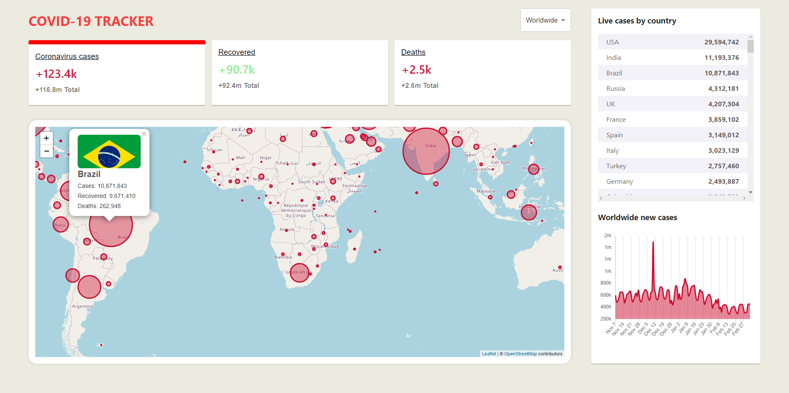

# Covid-19-Tracker-Application



### This application provides daily covid-19 statistics across the world. It also provides country-specific statistics. Has a great design and is in real time.
<br>

### Skills gathered while programming this application: 
    - Advanced JavaScript
    - Using public APIs
    - React Hooks
    - Redux
    - React LeafLet library (for creating maps)

<br>

## Tools
 - [REACT Js](REACT.js)
 
## Installation
- Clone the repository for the application:
    ```javascript
    git clone https://github.com/LehlohonoloMopeli/covid-19-tracker-app.git
    ```

- Install all the dependencies that are required
    ```javascript
    npm install
    ```

- To start the application
    ```javascript
    npm start or yarn start
    ```